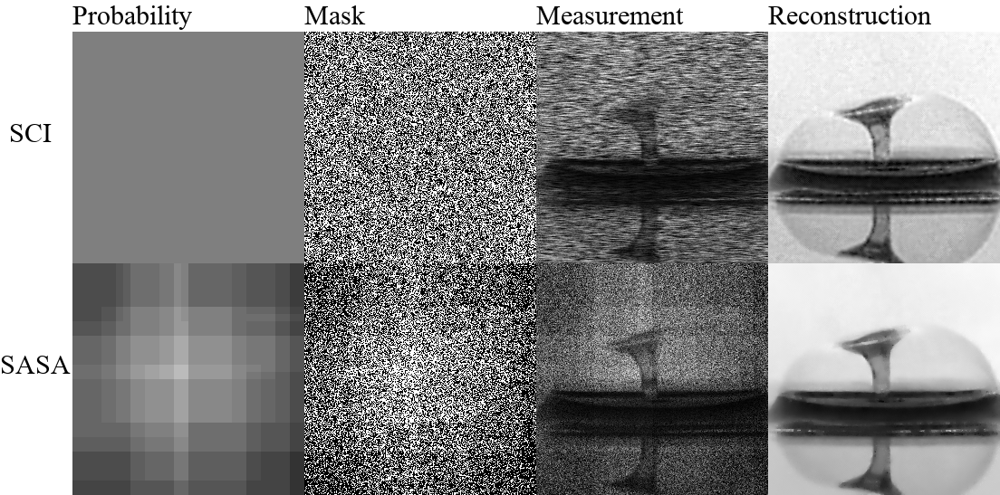

# SASA: Saliency-Aware Self-Adaptive Snapshot Compressive Imaging (ICASSP'2024)
In this repository we provide code of the paper:
> **SASA: Saliency-Aware Self-Adaptive Snapshot Compressive Imaging**
> 
> Yaping Zhao, Edmund Y. Lam
> 
> arxiv link: https://arxiv.org/abs/2401.00875

<p align="center">

</p>

## Requirements
For pre-requisites, run:
```
conda env create -f environment.yml
conda activate sasa
```

## Testing datasets
Testing datasets are provided in the `dataset/` folder.

Therefore, <span style="color:red">**you can quickly get started without additional downloads required**</span>.

## Usage
To reproduce the main results from our paper, simply run:
```
python sasa.py
```

# Citation
Cite our paper if you find it interesting!
```
@inproceedings{zhao2024sasa,
  title={{SASA}: Saliency-Aware Self-Adaptive Snapshot Compressive Imaging},
  author={Zhao, Yaping and Lam, Edmund Y},
  booktitle={IEEE International Conference on Acoustics, Speech and Signal Processing},
  year={2024}
}

@article{zhao2022mathematical,
  title={Mathematical Cookbook for Snapshot Compressive Imaging},
  author={Zhao, Yaping},
  journal={arXiv preprint arXiv:2202.07437},
  year={2022}
}
```
